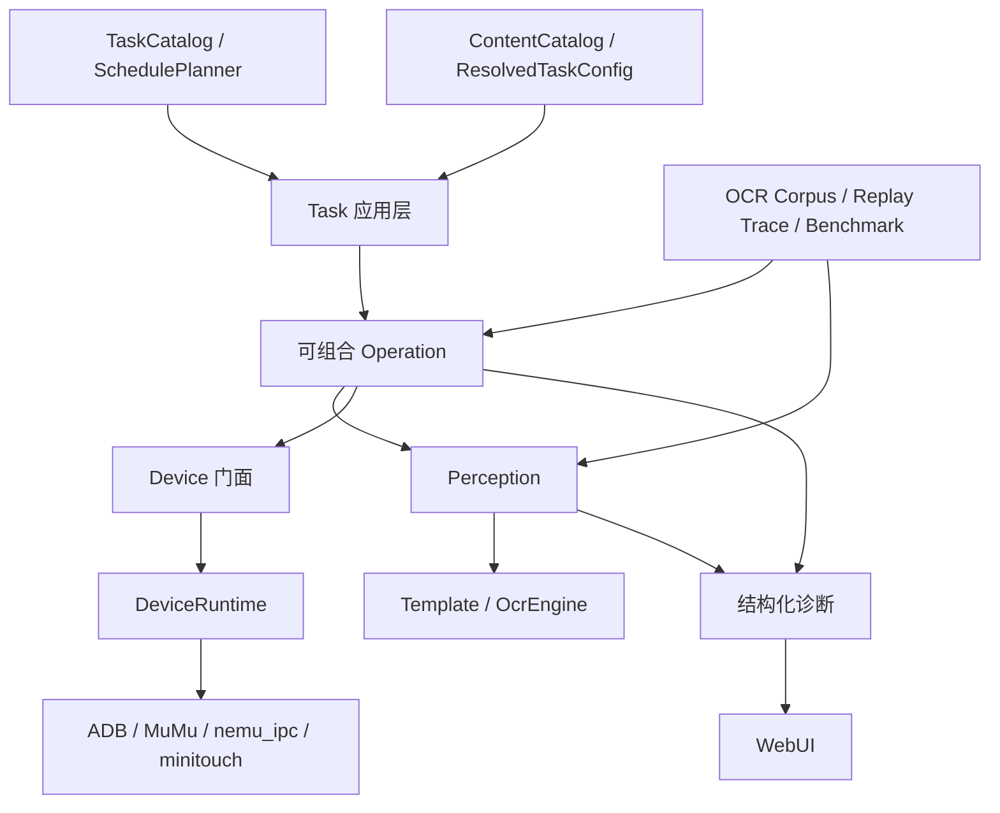

# ALAS 下一代演进与 OCR 现代化路线图

> 状态：已确认的研究决策与演进方向
> 日期：2026-07-11
> 范围：个人版 ALAS，Windows + MuMu + 国区 + WebUI

## 1. 摘要

本项目不再以“维持旧 ALAS 兼容”为主要目标，也不以完整迁移
[StarRailCopilot](https://github.com/LmeSzinc/StarRailCopilot) 为目标。当前代码已经完成内容目录、任务目录、配置快照、纯调度器、设备服务组合和回放门面的关键边界建设；重新搭一套框架会重复已有工作，并延迟真正影响正确率和维护效率的改进。

下一阶段采用**纵向切片式演进**，并暂时固定现有 CnOCR 模型：先完成两条最小切片——一条从识别结果到失败样本和业务判断，另一条从真实页面判断到设备动作和回放；各自验证价值后再扩大覆盖。当前最制约项目演进的问题是：

1. CnOCR 已返回文字和置信度，但当前只保留文字；解析失败又容易退化为静默的 `0`、零时长或空字符串。
2. 无效 OCR 没有保存裁剪图与失败上下文，既难诊断，也无法积累未来换模型需要的真实语料。
3. `ReplayDevice` 已存在，但尚未进入真实业务回归链，UI 更新和 OCR 错误仍主要依赖人工复现。
4. WebUI 通过解析最后一条日志文字判断进程结果，异常、手动停止和正常完成没有独立数据契约。
5. 大量命令式循环同时承担截图、识别、计时、动作和恢复，难以单独验证。

据此确定以下方向：

- 当前主线是**现有结果可信、确定浪费消除、失败可回放、运行可诊断**。
- 当前阶段不引入新 OCR 模型；先保留 CnOCR 的原始文字和置信度，建立严格解析与失败样本闭环。
- 性能优化只删除已经由代码和测量证明的无用推理，不先做通用缓存或全局批处理。
- 模型研究结论保留为长期附录；只有真实语料和独立迁移计划就绪后才启动模型替换。
- 不建设多平台插件系统、通用工作流 DSL、微服务或一次性重写现有状态机。

## 2. 研究范围与判断标准

### 2.1 运行约束

- Python 3.14.6，依赖与命令入口统一由 `uv` 管理。
- Windows + MuMu 12 + 国区 + WebUI。
- nemu_ipc 负责截图，minitouch 负责控制；ADB 是连接、shell、包名、forward 和控制服务启动的底座。
- OCR 在 CPU 上通过 ONNX Runtime 运行。
- 当前阶段固定使用现有 CnOCR 模型，不引入 PP-OCR 运行依赖。
- 游戏中的 OCR 主要处理固定区域、短文本和封闭字符集，不需要通用文档版面分析。

### 2.2 “相同运算量”的定义

模型文件大小、参数量和 FLOPs 不能直接代表本项目的真实成本。本文将“相同运算量”定义为：

- 同一台机器；
- 相同线程数和 ONNX Runtime 配置；
- 相同 ROI、预处理和输入宽度策略；
- 模型预热后的 p50/p95；
- 同时记录冷启动、常驻内存和模型体积。

模型选择首先比较真实项目准确率，在达到正确率门禁的候选中再比较以上运行指标。

### 2.3 证据等级

本文严格区分四类证据：

| 证据 | 能证明什么 | 不能证明什么 |
|---|---|---|
| 当前仓库源码 | 已落地的边界、调用形态和依赖 | 新模型的真实准确率 |
| SRC 当前源码 | 可借鉴的实现和仍存在的局限 | 这些设计一定适合个人版 ALAS |
| OCR 官方同条件数据 | Paddle 模型内部的相对能力 | Paddle 模型一定胜过当前 CnOCR |
| 本机合成 ROI 基准 | 同机速度、启动和体积 | 真实游戏截图准确率 |

## 3. 当前架构基线

旧的[可扩展架构实施计划](superpowers/plans/2026-07-10-alas-extensible-architecture.md)已经基本落地，不能再把其中的基础组件写成未来设想。

### 3.1 内容层

- [`ContentId`、`StageRef`、`StageSpec` 和 `EventPack`](../module/content/models.py#L14)已经形成明确的数据契约。
- [`ContentCatalog`](../module/content/catalog.py#L7)负责内容包与关卡的唯一性和解析。
- 当前有 132 个活动 manifest、7 个原生 StageSpec。
- [`CampaignRun`](../module/campaign/run.py#L194)优先装载原生 StageSpec，历史关卡通过适配器继续运行。

新活动应继续以 manifest、StageSpec 和有限策略为机器真相；历史内容只在实际修改时迁移。

### 3.2 任务、配置与调度

- [`TaskDefinition` 和 `TASK_CATALOG`](../module/task_registry.py#L73)已经统一任务身份、执行器、配置作用域、优先级和启动模式。
- [`ResolvedTaskConfig`](../module/config/resolved.py#L17)已经提供不可变解析快照。
- [`SchedulePlanner`](../module/config/schedule.py#L62)已经把任务选择变成可独立测试的纯逻辑。

因此下一步不是再建立一套任务注册或调度框架，而是先让现有业务方法通过这些边界产生可诊断结果并完成真实回放；Operation 和 Perception 只在回放暴露出清晰边界后提取。

### 3.3 设备层

- [`DeviceRuntime`](../module/device/runtime.py#L258)已经显式组合 ADB、MuMu、nemu_ipc 截图、minitouch 控制和应用进程管理。
- 上层仍通过 [`Device`](../module/device/device.py#L46) 门面调用截图、点击、滑动和应用控制。

个人版不需要复制 SRC 的多平台、多截图后端和多控制后端选择逻辑。后续设备工作应继续减少门面内部的继承耦合，但不扩展运行平台。

### 3.4 回放层

- [`ReplayDevice`](../module/replay/device.py#L40)已经支持截图、点击和滑动的语义回放。
- [`ReplayFrame`、动作类型及 trace 读写函数](../module/replay/trace.py#L33)已经提供帧与动作记录契约。
- 当前回放能力主要由自身单元测试覆盖，尚未连接真实业务流程。

“有回放类”不等于“业务可回放”。下一阶段必须先让现有业务方法及其内嵌感知逻辑在 ReplayDevice 上运行。

### 3.5 当前主要缺口位于感知层

当前 OCR 的事实是：

- [`OcrModel`](../module/ocr/models.py#L11)中的两个逻辑模型名实际加载同一个 CnOCR 模型。
- [`AlOcr`](../module/ocr/al_ocr.py#L15)固定使用 `densenet_lite_136-gru`，并通过 `det_model_name=""` 关闭文本检测。
- [`_extract_text()`](../module/ocr/al_ocr.py#L36)立即丢弃置信度和其他识别元数据。
- [`Ocr`](../module/ocr/ocr.py#L38)负责固定 ROI 裁剪、颜色或 YUV 预处理、调用模型和领域后处理。
- [`Digit`、`DigitCounter` 和 `Duration`](../module/ocr/ocr.py#L114)分别约束字符表并解析业务值。

AST 静态构造点统计如下：

| 类型 | 构造点 |
|---|---:|
| Digit 家族 | 72 |
| DigitCounter 家族 | 21 |
| Duration 家族 | 5 |
| 一般文本 Ocr 家族 | 9 |

107 个构造点中有 98 个是结构化数字短文本。项目需要的是固定裁剪、封闭字符集和低延迟的识别器，而不是通用文档 OCR。

## 4. StarRailCopilot 研究结论

SRC 的 README 将其称为“基于下一代 Alas 框架”，并明确提出更新 OCR、配置 Pydantic 化、改善 Assets 管理和降低游戏耦合四个目标。当前默认分支源码表明它是渐进式演进项目，而不是已经完成的理想框架。

### 4.1 值得吸收的部分

| SRC 经验 | 本项目采用方式 |
|---|---|
| `module/` 与 `tasks/` 的逻辑边界 | 稳定框架能力留在 `module/`，新业务进入 `tasks/<domain>`；旧业务按触碰迁移 |
| 任务域内共置 assets、keywords 和领域模型 | 新任务保持领域资源就近，跨任务共享必须有真实第三个调用方 |
| OCR 的预处理、推理、后处理、关键词匹配分层 | 建立 OcrEngine、OcrProfile、RecognitionResult，领域值解析留在业务类型 |
| OCR 单行、多行、检测识别使用不同入口 | 本项目只保留真实需要的固定 ROI 单行/多行识别，不复制通用检测入口 |
| 对模型和资源生命周期进行显式释放 | 模型版本、校验摘要、加载和释放由单一运行时对象负责 |
| Pydantic 用于 planner、route 等边界模型 | Pydantic 只用于 JSON、YAML、WebUI 等外部输入，内部继续使用不可变运行时对象 |

### 4.2 不应照搬的部分

- SRC 当前 OCR 使用 `pponnxcr==2.0`，说明“替换 CnOCR”的方向正确，但不能代表 2026 年本项目的最佳模型选择。
- README 描述了配置 Pydantic 化目标，但当前主配置仍保留生成配置与动态绑定；不能把目标描述误当成已经完成的架构。
- 全局资源注册、全局可变 OCR 单例、字符串反射调度和大对象多重继承仍存在，不应成为新边界。
- 多平台设备探测和运行时后端选择解决的是 SRC 的发布范围问题，个人版 ALAS 只有一个明确设备栈，复制这些能力只会增加分支和测试成本。
- 目录搬迁本身不产生业务价值。只有当模块被修改、需要独立测试或出现清晰依赖边界时才迁移。

### 4.3 最终判断

SRC 最重要的启发不是某个目录名或依赖，而是把游戏任务、感知、资源和设备逐步分开。本项目已经在内容、任务、配置、调度和设备层先行完成了大部分基础；下一步应沿相同原则补齐感知与回放，而不是从头复制 SRC。

## 5. 长期 OCR 模型研究记录（当前不实施）

本节保留本轮模型调研结果，避免未来重新从零调查；它不属于当前实施路线。当前阶段继续使用 CnOCR，只优化结果契约、失败闭环和已证实的运行浪费。

### 5.1 当前模型

当前依赖锁定结果是 CnOCR 2.3.3、ONNX Runtime 1.27.0，实际识别模型为 `densenet_lite_136-gru`。CnOCR 官方给出的模型规模约为 3.1M 参数、12MB，但没有提供与当前 PaddleOCR 模型共用数据集、同硬件的绝对准确率与 CPU 延迟。

因此可以确认：

- 当前模型没有证据继续被称为同预算最强模型。
- 公开数据不足以直接证明某个 Paddle 模型在真实碧蓝航线截图上全面击败它。
- 最终结论必须来自项目自己的标注 ROI。

### 5.2 官方同条件数据

PP-OCRv6 论文把 v5 mobile、v6 tiny 和 v6 small 放在同一 15 类内部多场景识别集上评测：

| 模型 | 参数量 | 模型大小 | 加权平均 | 屏幕文字 | 印刷中文 | 印刷英文 | 裁剪边距稳定性 |
|---|---:|---:|---:|---:|---:|---:|---:|
| PP-OCRv5 mobile | 约 5M | 16MB | 73.7 | 57.6 | 86.0 | 86.0 | 57.74 |
| PP-OCRv6 tiny | 1.1M | 4.4MB | 73.5 | 71.2 | 86.7 | 88.4 | 44.80 |
| PP-OCRv6 small | 5.2M | 20.4MB | 81.3 | 79.7 | 90.5 | 93.3 | 67.80 |

这些数据支持两个判断：

- v6 small 是开箱准确率优先的候选，尤其适合屏幕文字和裁剪变化。
- v6 tiny 是严格低资源预算的候选，屏幕文字能力优于 v5 mobile，但裁剪边距稳定性较弱。

该表只能直接比较 Paddle 模型之间的相对表现，不能与 CnOCR 的其他测试结果横向拼接。

### 5.3 Ryzen 7 5700X 本机探索性基准

测试条件：CPU 单线程 ONNX Runtime、5 个合成短 ROI、每个 ROI 80 次、10 次预热、模型已缓存。PP-OCRv6 tiny 使用适合短 ROI 的动态最小宽度 32。

| 模型 | 单张 p50 / p95 | 5 张顺序 p50 / p95 | 缓存模型初始化 | 模型大小 |
|---|---:|---:|---:|---:|
| 当前 CnOCR | 4.509 / 5.754ms | 18.990 / 22.994ms | 4565ms | 11.989MiB |
| PP-OCRv6 tiny，动态宽度 | **2.717 / 3.377ms** | **11.353 / 11.976ms** | **478ms** | **4.282MiB** |
| PP-OCRv5 ch mobile | 12.941 / 16.027ms | 55.837 / 56.923ms | 538ms | 15.861MiB |
| PP-OCRv5 en mobile | 11.332 / 14.262ms | 49.058 / 51.123ms | 526ms | 7.508MiB |
| PP-OCRv6 small | 12.810 / 17.226ms | 54.801 / 58.153ms | 543ms | 20.251MiB |

本机结果说明：

- v6 tiny 在当前短 ROI 形态下，单张约快 1.7 倍，5 张顺序识别约快 1.7～1.9 倍。
- RapidOCR 默认宽度 320 时，v6 tiny 单张为 4.413 / 4.615ms，只与当前模型接近；动态短宽度是速度优势的必要条件。
- 不同宽度 ROI 强行组成一个 batch 会补齐到最长宽，当前场景默认应逐张识别；是否按宽度分桶必须由真实测量决定。
- PP-OCRv5 和 v6 small 在本机固定短 ROI 上明显慢于当前模型，不属于同延迟档默认候选。

这些合成 ROI 只能证明运行性能和接口可行性，不能作为真实游戏准确率结论。

### 5.4 长期候选结论

1. 当前阶段不迁移模型，现有 CnOCR 继续作为唯一生产后端。
2. 未来重启模型项目时，`PP-OCRv6_tiny_rec` 是第一个同预算评测候选，不是当前默认模型。
3. `PP-OCRv6_small_rec` 只作为准确率参考上界，不预先设计双模型路由。
4. 未来候选仍应只做固定 ROI 识别，使用动态短宽度；检测和批处理必须由真实数据证明必要。
5. 最终模型由真实游戏 ROI 的整串完全匹配率与同机 p95 决定，不能由参数量、模型体积或通用榜单决定。
6. 只有真实语料、评测工具、回放门禁和独立迁移计划全部就绪后，才讨论删除 CnOCR。

## 6. 目标架构



### 6.1 稳定内核

设备、调度、配置解析、内容目录、感知接口和回放契约继续放在 `module/` 的稳定内核子包中。新增内核子包不得反向导入 `tasks/` 或具体活动；现有 `module/` 业务模块可以暂留，并在实际修改时迁移。

### 6.2 业务任务

新业务进入 `tasks/<domain>`，任务负责组合配置、内容和 Operation。旧业务只在出现真实修改需求时迁移，避免为了目录整齐制造大范围导入变更。

### 6.3 Operation

Operation 表示可复用、可回放的业务操作，例如页面切换、列表扫描、奖励领取和关卡进入。首批回放直接使用现有真实方法，不预先建立 Operation 基类；只有回放暴露出清晰边界，并满足以下至少一项时才提取：

- 同一语义已经出现至少三次；
- UI 经常变化；
- 当前流程难以独立测试；
- 失败诊断需要跨多帧保留状态。

Operation 不解释任意 DSL，也不取代成熟的战役、科研或大世界状态机。

### 6.4 Perception 与 OCR

| 组件 | 唯一职责 |
|---|---|
| `OcrEngine` | 当前封装现有 CnOCR，接收单个或多个裁剪图及 profile，默认逐张推理 |
| `OcrProfile` | 定义预处理、字符集、格式约束和输入宽度策略 |
| `RecognitionResult` | 保存原始文字、规范化文字、置信度、业务值、有效性、失败原因、耗时、profile 和模型版本 |
| `Digit` / `DigitCounter` / `Duration` | 将识别文本转换为领域值 |
| Template matcher | 判断图像状态，不执行设备动作 |

CnOCR 的 score 先完整记录分布，不凭经验写阈值。空输出和格式不匹配立即成为结构化失败；计数器使用完整匹配并拒绝 `current > total`，时长拒绝分钟或秒大于 59。合法数值 `0` 与识别失败必须可区分。

迁移期旧 `.ocr()` 可以把结构化结果转换为历史返回类型，但新调用方直接读取 `valid` 和 `reason`；适配层只用于渐进迁移，不形成新的长期兼容层。无效结果保存原始 ROI、预处理 ROI 和元数据，按 profile 与图像摘要去重并设置容量上限。

“接收多个 ROI”只表示调用接口可以一次提交多个请求，不等于把不同宽度图像补齐后执行同一个 ONNX tensor batch。默认实现逐张推理；只有按宽度分桶被真实基准证明更快时才启用张量批处理。

### 6.5 当前模型的运行优化边界

- `azur_lane` 与 `cnocr` 当前指向同一个 ONNX 模型。共享会话前必须把“设置候选字符集 + 推理”放在同一个串行边界，避免全局可变字符集互相污染。
- 首次 CnOCR 导入是主要冷启动成本。需要预热时，在业务计时器启动前同步完成；不使用后台线程掩盖尚未建立的线程安全问题。
- 只跳过能由便宜前置判断证明无用的推理，例如空槽位或前一字段已经无效的同帧后续字段。
- 不先做通用同帧缓存、跨帧近似缓存、TTL 或感知哈希。若真实 trace 证明有收益，只允许缓存同一 frame generation 下逐字节相同的预处理 ROI。
- 不全局设置 `batch_size=len(images)`。只有真实调用点的预处理后宽度接近、A/B 基准更快且逐项输出一致时才启用小批量。

### 6.6 Replay 与评测

Replay 读取固定帧并记录语义动作，不启动 ADB、模拟器、WebUI 或真实控制服务。第一步只补真实 `ModuleBase.appear()` 必需的非语义兼容面，例如 `stuck_record_add()` 和只读 `has_cached_image`，不伪造拖拽、长按、应用控制等尚未需要的设备能力。

首条回放直接运行 `InfoHandler.handle_popup_confirm()`，验证真实 assets、模板判断和语义点击；第二条运行 `Daily.daily_enter()` 的 2～3 帧业务路径。两条路径稳定后，再从中提取可复用 Operation。

评测语料与业务回放承担不同职责：

- OCR corpus 判断单个 ROI 的识别正确率和性能。
- Replay trace 判断多帧业务流程、动作顺序和错误恢复。

### 6.7 配置、资源与 WebUI

- `ProcessManager` 使用独立、可序列化的 `ProcessOutcome` 记录完成、异常、手动停止、强杀、任务名、异常类型和结束时间；WebUI 状态不再解析最后一条日志。
- 配置侧先增加只读 `ConfigIssue`，报告非法选项、默认回退、字段来源和运行时 override，不改变现有持久化与返回类型。
- 资源侧先增加只读 snapshot 和生成期引用校验，不为了统计强制导入所有业务模块或加载全部图片。
- 新资源仍由内容包或任务域显式拥有；当前阶段不重写全局资源注册和释放策略。
- Pydantic 仅用于新的 JSON、YAML、WebUI 外部输入边界；`ResolvedTaskConfig` 继续作为内部不可变快照。

## 7. 分阶段更新路线

### P0：让现有 CnOCR 结果可判断、可积累

**产出：**

- 非破坏性的结构化识别结果：`raw_text`、`normalized_text`、`score`、`value`、`valid`、`reason`、`latency`、`profile`、`model`。
- Counter 使用完整匹配并校验 `current <= total`；Duration 校验分钟、秒小于 60。
- 语法无效或业务约束失败时保存原始 ROI、预处理 ROI 和元数据，按图像摘要去重并限额。
- 首个纵向切片选择 `meow_get_buy_count()`：计数器有效后才识别金币，调用者使用现有循环按 `valid` 重试。
- 回归样本覆盖空串、合法零、`99/15`、加载中错误和下一帧恢复。

**实施状态（2026-07-12）：**

- 已在 [`RawOcrResult` 与 `RecognitionResult`](../module/ocr/result.py#L7) 建立原始文字、score、规范化结果、业务值、有效性、失败原因、耗时、profile 和模型名契约；[`AlOcr` 原始结果入口](../module/ocr/al_ocr.py#L44)保留第三方 `text` 与 `score`，CnOCR 的批量扩展点保持原始字典契约，项目字符串接口只在边界完成投影。
- [`Digit` 与 `DigitCounter`](../module/ocr/ocr.py#L227) 已提供严格结构化解析，能够区分合法 `0` 与失败，并拒绝 Counter 部分匹配、`current > total` 和不符合调用点约束的 total。[`Duration`](../module/ocr/ocr.py#L451) 结构化接口已具备，生产调用点待按触碰迁移；旧 `.ocr()` 语义仍保留给未迁移调用方。
- [`OcrFailureStore`](../module/ocr/failure_store.py#L112) 已按稳定摘要保存 `raw.png`、`processed.png` 与 `metadata.json`，并实施去重、容量限制、原子发布和失败熔断；root 是调用方信任的本地目录并允许 junction 重定向，reparse 检查只用于避免失败清理沿子级临时路径误删，另有同进程限额串行化与异常日志脱敏。只有结构化数字调用显式传入 recorder 时才会记录失败，一般文本 OCR 不自动采集。
- [`meow_get_buy_count()`](../module/meowfficer/buy.py#L19) 已完成首条纵向切片：Counter 无效时跳过金币 OCR，Counter 或金币失败都按下一帧重试，合法零值不被真假判断误伤；有限帧回归见 [`test_meowfficer_buy.py`](../tests/test_meowfficer_buy.py#L140)。
- P0 严格审查与 PR 机器人反馈已处理；收缩无效兼容和过度路径防御后，全量门禁为 `1546 passed, 1 skipped`，[fork PR #3](https://github.com/NothingToDooo/AzurLaneAutoScript/pull/3) 已创建。P1～P5 尚未进入实施。

**退出条件：** 失败与合法零值完全可区分；失败样本带有足够上下文，可离线复现相同解析结果；旧调用点行为未被批量改变。

### P1：删除确定无用的推理与重复资源

**产出：**

- `dorm_food_get()` 只 OCR 已被前置颜色判断确认存在的食物槽。
- 沿“便宜前置判断或前一字段决定后一 OCR 是否有意义”的规则审计其他同帧调用，不引入通用缓存。
- `azur_lane` 与 `cnocr` 共享同一模型会话；候选字符集设置与推理由同一串行边界保护。
- 记录每个 profile 的调用次数、耗时和多 ROI 宽度分布，作为以后讨论缓存或批处理的依据。
- 若首次 OCR 会侵占业务 timeout，在业务计时器启动前同步预热；不做后台线程预热。

**退出条件：** 每项优化都有调用次数或内存数据证明收益；结果逐项一致；没有全局缓存、全局批处理或并发字符集切换。

### P2：让 ReplayDevice 跑通真实业务代码

**产出：**

- 只补 `ModuleBase.appear()` 所需的 `stuck_record_add()`，以及真实构造需要时的只读 `has_cached_image`。
- 使用真实 `InfoHandler.handle_popup_confirm()` 跑通“模板判断 → 语义点击 → trace 完整消费”，测试不得覆写 `appear()`。
- 使用真实 `Daily.daily_enter()` 覆盖“点击入口 → 进入战斗”和“领奖 → 返回任务页”两个 2～3 帧场景。
- fixture 使用去除 UID 的真实截图，不导入 ADB、MuMu、WebUI 或真实 DeviceRuntime。

**退出条件：** ReplayDevice 不再只有自身测试；至少一条通用 handler 和一条业务流程使用生产实现完成回放。

### P3：建立结构化进程结果

**产出：**

- 独立 outcome queue 和不可变 `ProcessOutcome`，区分 `finished`、`failed`、`manual_stop`、`killed`。
- outcome 保存 config、command、异常类型、短消息和结束时间。
- 日志线程在进程退出且队列排空后结束，Rich 日志继续保留完整 traceback。
- `ProcessManager.state` 和 WebUI 三色状态读取 outcome，不再解析最后一条日志文字。

**退出条件：** 正常完成、未知异常、手动停止和强杀都有确定测试，最终异常日志不会因进程退出竞态丢失。

### P4：增加只读配置与资源诊断

**产出：**

- `ConfigIssue(path, raw, resolved, reason)` 报告非法选项、默认回退、隐藏字段重置和迁移。
- WebUI 展示 `ResolvedTaskConfig.bind_chain`、字段 `source_path` 和 override 标记。
- `ResourceSnapshot` 只读报告注册数、已加载数、按类型统计和最近释放数量。
- 资源生成工具汇总错误分辨率和悬空引用，不强制加载生产资源。
- 新活动继续默认使用 manifest、StageSpec 和有限策略。

**退出条件：** 诊断只观察现有行为，不改变配置解析结果、持久化格式或资源释放策略。

### P5：有回放保护后再扩大 Operation 与任务域

**产出：**

- 只从已被真实回放锁定的流程中提取 `Perception(image) -> observation` 和单步 `observation -> action/result`。
- 外层 while、Timer 和领域终止条件暂留原方法，不建立 Operation 继承树。
- 至少出现三个同形流程后，才考虑共同循环驱动器。
- 新业务进入 `tasks/<domain>`；旧业务按触碰迁移，稳定状态机保持不动。

**退出条件：** Operation 不直接拥有设备实现细节，Perception 不执行动作，旧行为有特征测试或回放锁定；新功能不增加配置、资源或任务身份的第二份真相。

## 8. 验收门禁

### 8.1 OCR

- 当前生产模型保持不变，结构化接口必须保留 CnOCR 原始文字和 score。
- Digit、DigitCounter、Duration 的合法值与失败状态可区分；`99/15`、非法分钟秒和部分匹配不得静默变成合法值。
- score 先记录真实分布，不在缺少标注集时写置信度阈值。
- 失败样本必须包含原始 ROI、预处理 ROI、profile、文字、score、失败原因和模型标识，并按摘要去重限额。
- 跳过推理必须由确定的前置条件证明结果不会被使用；结果与历史有效输入逐项一致。
- 共享模型会话时，“设置候选字符集 + 推理”必须处于同一个串行边界。
- 预热只能发生在业务计时器启动前；后台线程预热、全局缓存和全局批处理不进入当前阶段。

### 8.2 Replay 与 Operation

- `InfoHandler.handle_popup_confirm()` 使用真实模板判断和点击逻辑完成回放，测试不得覆写 `appear()`。
- `Daily.daily_enter()` 至少覆盖进入战斗和领奖返回两个真实多帧路径。
- ReplayDevice 不触发真实 ADB、nemu_ipc、minitouch 或 WebUI。
- 首批回放直接使用现有生产方法；只有回放稳定后才提取 Operation。
- Perception 只返回结构化解释，Device 只负责动作和设备生命周期。

### 8.3 进程、配置与资源诊断

- WebUI 进程状态来自 `ProcessOutcome`，不能依赖日志后缀或最后一条 renderable。
- 子进程退出后 outcome 与日志队列均被排空，异常短消息和完整 traceback 都可获取。
- `ConfigIssue` 与 `ResourceSnapshot` 是只读诊断，不改变配置结果、持久化格式或资源加载状态。

### 8.4 长期模型替换启动条件

只有以下条件全部满足，才新开独立模型迁移计划：

- 真实 ROI 语料覆盖数字、计数器、时间、关卡名和少量中文，并有稳定标注。
- 当前 CnOCR 基线可重复运行，按 profile 记录整串完全匹配率、p50/p95、冷启动、内存和体积。
- OCR 失败样本与关键业务 Replay 已进入回归门禁。
- 候选模型在同一评测入口下比较，不能拼接不同数据集的官方数字。
- 模型替换不会与当前结果契约、Replay 或 WebUI 诊断建设并行争夺主线。

### 8.5 项目门禁

每个阶段完成时运行：

```powershell
uv sync --check
uv run ruff check . --no-cache
uv run ruff format --check .
uv run ty check
uv run pytest
git diff --check
```

阶段完成还必须满足：工作区无意外文件、没有新增配置或资源的第二份真相、没有为了未来可能性加入未使用抽象。

## 9. 非目标

- 当前阶段不引入 PP-OCR 或其他新模型运行依赖。
- 不全量重写战役、科研和大世界状态机。
- 不建设通用 FSM、工作流 DSL 或动态插件市场。
- 不恢复多平台、多服务器、多截图或多控制后端。
- 不用 Pydantic 重写现有配置。
- 不先做通用同帧缓存、跨帧近似缓存、TTL、感知哈希或全局批处理。
- 不使用后台线程预热尚未建立线程安全边界的 OCR。
- 不为了未来换模型建立多个后端、路由器或长期兼容层。
- 不在缺少真实语料时先训练模型。
- 不在缺少错误数据时预先维护多个 OCR 模型路由。
- 不为了目录整齐批量移动稳定业务代码。

## 10. 决策总结

| 问题 | 决策 |
|---|---|
| 是否重写框架 | 否；沿已落地边界做纵向切片 |
| 是否整体迁移 SRC | 否；吸收分层与任务域思想，拒绝其遗留耦合 |
| 当前主要矛盾 | 现有识别失败不可区分、不可积累、不可回放 |
| 当前生产 OCR | 固定使用 CnOCR，不引入新模型 |
| 首个 OCR 切片 | `meow_get_buy_count()` 的结构化结果、严格解析、按 valid 重试和失败 ROI |
| 确定性性能方向 | 跳过无用推理、共享重复会话、必要时同步预热 |
| 首批 Replay | `handle_popup_confirm()`，随后 `Daily.daily_enter()` |
| WebUI 方向 | `ProcessOutcome` 取代日志文字解析 |
| 长期模型候选 | PP-OCRv6 tiny 先评测，PP-OCRv6 small 作为准确率参考 |
| 模型项目启动条件 | 真实语料、基线、失败闭环、Replay 和独立迁移计划全部就绪 |
| 新业务组织 | `tasks/<domain>` + 可组合 Operation |
| 配置建模 | 外部边界严格解析，内部不可变快照 |
| 历史业务迁移 | 按触碰迁移，不全量搬家 |

## 11. 资料来源

### 本项目

- [ALAS 可扩展架构实施计划](superpowers/plans/2026-07-10-alas-extensible-architecture.md)
- [OCR 调用门面](../module/ocr/ocr.py)
- [当前 CnOCR 封装](../module/ocr/al_ocr.py)
- [OCR 模型别名与会话](../module/ocr/models.py)
- [喵箱购买计数](../module/meowfficer/buy.py)
- [后宅食物槽识别](../module/dorm/dorm.py)
- [内容目录](../module/content/catalog.py)
- [任务目录](../module/task_registry.py)
- [配置快照](../module/config/resolved.py)
- [纯调度器](../module/config/schedule.py)
- [设备运行时](../module/device/runtime.py)
- [回放设备](../module/replay/device.py)
- [通用弹窗处理](../module/handler/info_handler.py)
- [每日任务进入流程](../module/daily/daily.py)
- [WebUI 进程管理](../module/webui/process_manager.py)

### StarRailCopilot 固定源码快照

- [SRC README 与下一代目标](https://github.com/LmeSzinc/StarRailCopilot/blob/4d3a708402a410e4b1ee2425fa3a77a90833ea0c/README.md)
- [SRC OCR 模型管理](https://github.com/LmeSzinc/StarRailCopilot/blob/4d3a708402a410e4b1ee2425fa3a77a90833ea0c/module/ocr/models.py)
- [SRC OCR 分层](https://github.com/LmeSzinc/StarRailCopilot/blob/4d3a708402a410e4b1ee2425fa3a77a90833ea0c/module/ocr/ocr.py)
- [SRC 资源生命周期](https://github.com/LmeSzinc/StarRailCopilot/blob/4d3a708402a410e4b1ee2425fa3a77a90833ea0c/module/base/resource.py)
- [SRC 依赖与 pponnxcr](https://github.com/LmeSzinc/StarRailCopilot/blob/4d3a708402a410e4b1ee2425fa3a77a90833ea0c/requirements-in.txt)

### OCR 官方资料

- [CnOCR V2.3 官方发布说明](https://www.breezedeus.com/article/cnocr-v2.3-better-more)
- [PaddleOCR 文本识别模型表](https://github.com/PaddlePaddle/PaddleOCR/blob/211989f046cc1878460f9e65574690c00a127a1a/docs/version3.x/module_usage/text_recognition.en.md)
- [PP-OCRv6 论文](https://arxiv.org/html/2606.13108v1)
