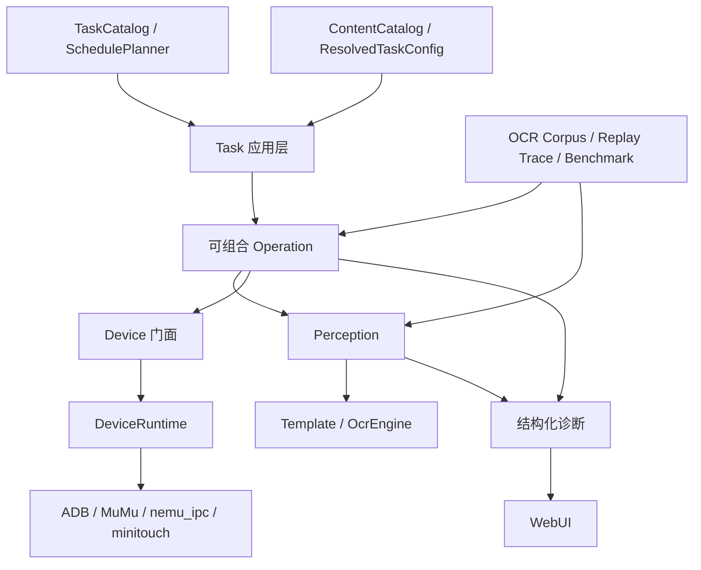

# ALAS 下一代演进与 OCR 现代化路线图

> 状态：已确认的研究决策与演进方向
> 日期：2026-07-11
> 范围：个人版 ALAS，Windows + MuMu + 国区 + WebUI

## 1. 摘要

本项目不再以“维持旧 ALAS 兼容”为主要目标，也不以完整迁移
[StarRailCopilot](https://github.com/LmeSzinc/StarRailCopilot) 为目标。当前代码已经完成内容目录、任务目录、配置快照、纯调度器、设备服务组合和回放门面的关键边界建设；重新搭一套框架会重复已有工作，并延迟真正影响正确率和维护效率的改进。

下一阶段采用**纵向切片式演进**：先把一个真实业务路径从任务、操作、感知、设备到回放完整打通，再逐步扩大覆盖。当前最制约项目演进的问题是：

1. 感知结果缺少真实数据评测，无法证明 OCR 模型升级是否提高了项目正确率。
2. OCR 后端、领域解析和失败语义耦合，置信度被丢弃，错误容易退化为静默的 `0` 或空字符串。
3. `ReplayDevice` 已存在，但尚未进入真实业务回归链，UI 更新和 OCR 错误仍主要依赖人工复现。
4. 大量命令式循环同时承担截图、识别、计时、动作和恢复，难以单独验证。

据此确定以下方向：

- 下一阶段主线是**感知可评测、失败可回放、新流程可组合**。
- OCR 的同预算默认候选是 `PP-OCRv6_tiny_rec`；`PP-OCRv6_small_rec` 是开箱准确率参考上界，不是默认运行模型。
- 最终模型由真实碧蓝航线 ROI 语料的整串完全匹配率（exact-match）与同机 p95 决定，不能由参数量、模型体积或通用榜单直接决定。
- 真实数据证明迁移完成后，删除 CnOCR 依赖、旧模型路径和临时兼容层。
- 不建设多平台插件系统、通用工作流 DSL、微服务或一次性重写现有状态机。

## 2. 研究范围与判断标准

### 2.1 运行约束

- Python 3.14.6，依赖与命令入口统一由 `uv` 管理。
- Windows + MuMu 12 + 国区 + WebUI。
- nemu_ipc 负责截图，minitouch 负责控制；ADB 是连接、shell、包名、forward 和控制服务启动的底座。
- OCR 在 CPU 上通过 ONNX Runtime 运行。
- 游戏中的 OCR 主要处理固定区域、短文本和封闭字符集，不需要通用文档版面分析。

### 2.2 “相同运算量”的定义

模型文件大小、参数量和 FLOPs 不能直接代表本项目的真实成本。本文将“相同运算量”定义为：

- 同一台机器；
- 相同线程数和 ONNX Runtime 配置；
- 相同 ROI、预处理和输入宽度策略；
- 模型预热后的 p50/p95；
- 同时记录冷启动、常驻内存和模型体积。

模型选择首先比较真实项目准确率，在达到正确率门禁的候选中再比较以上运行指标。

### 2.3 证据等级

本文严格区分四类证据：

| 证据 | 能证明什么 | 不能证明什么 |
|---|---|---|
| 当前仓库源码 | 已落地的边界、调用形态和依赖 | 新模型的真实准确率 |
| SRC 当前源码 | 可借鉴的实现和仍存在的局限 | 这些设计一定适合个人版 ALAS |
| OCR 官方同条件数据 | Paddle 模型内部的相对能力 | Paddle 模型一定胜过当前 CnOCR |
| 本机合成 ROI 基准 | 同机速度、启动和体积 | 真实游戏截图准确率 |

## 3. 当前架构基线

旧的[可扩展架构实施计划](superpowers/plans/2026-07-10-alas-extensible-architecture.md)已经基本落地，不能再把其中的基础组件写成未来设想。

### 3.1 内容层

- [`ContentId`、`StageRef`、`StageSpec` 和 `EventPack`](../module/content/models.py#L14)已经形成明确的数据契约。
- [`ContentCatalog`](../module/content/catalog.py#L7)负责内容包与关卡的唯一性和解析。
- 当前有 132 个活动 manifest、7 个原生 StageSpec。
- [`CampaignRun`](../module/campaign/run.py#L194)优先装载原生 StageSpec，历史关卡通过适配器继续运行。

新活动应继续以 manifest、StageSpec 和有限策略为机器真相；历史内容只在实际修改时迁移。

### 3.2 任务、配置与调度

- [`TaskDefinition` 和 `TASK_CATALOG`](../module/task_registry.py#L73)已经统一任务身份、执行器、配置作用域、优先级和启动模式。
- [`ResolvedTaskConfig`](../module/config/resolved.py#L17)已经提供不可变解析快照。
- [`SchedulePlanner`](../module/config/schedule.py#L62)已经把任务选择变成可独立测试的纯逻辑。

因此下一步不是再建立一套任务注册或调度框架，而是让新任务通过这些边界组合 Operation、Perception 和 Device。

### 3.3 设备层

- [`DeviceRuntime`](../module/device/runtime.py#L258)已经显式组合 ADB、MuMu、nemu_ipc 截图、minitouch 控制和应用进程管理。
- 上层仍通过 [`Device`](../module/device/device.py#L46) 门面调用截图、点击、滑动和应用控制。

个人版不需要复制 SRC 的多平台、多截图后端和多控制后端选择逻辑。后续设备工作应继续减少门面内部的继承耦合，但不扩展运行平台。

### 3.4 回放层

- [`ReplayDevice`](../module/replay/device.py#L40)已经支持截图、点击和滑动的语义回放。
- [`ReplayFrame`、动作类型及 trace 读写函数](../module/replay/trace.py#L33)已经提供帧与动作记录契约。
- 当前回放能力主要由自身单元测试覆盖，尚未连接真实业务流程。

“有回放类”不等于“业务可回放”。下一阶段必须让真实 Operation 和 Perception 在 ReplayDevice 上运行。

### 3.5 当前主要缺口位于感知层

当前 OCR 的事实是：

- [`OcrModel`](../module/ocr/models.py#L11)中的两个逻辑模型名实际加载同一个 CnOCR 模型。
- [`AlOcr`](../module/ocr/al_ocr.py#L15)固定使用 `densenet_lite_136-gru`，并通过 `det_model_name=""` 关闭文本检测。
- [`_extract_text()`](../module/ocr/al_ocr.py#L36)立即丢弃置信度和其他识别元数据。
- [`Ocr`](../module/ocr/ocr.py#L38)负责固定 ROI 裁剪、颜色或 YUV 预处理、调用模型和领域后处理。
- [`Digit`、`DigitCounter` 和 `Duration`](../module/ocr/ocr.py#L114)分别约束字符表并解析业务值。

AST 静态构造点统计如下：

| 类型 | 构造点 |
|---|---:|
| Digit 家族 | 72 |
| DigitCounter 家族 | 21 |
| Duration 家族 | 5 |
| 一般文本 Ocr 家族 | 9 |

107 个构造点中有 98 个是结构化数字短文本。项目需要的是固定裁剪、封闭字符集和低延迟的识别器，而不是通用文档 OCR。

## 4. StarRailCopilot 研究结论

SRC 的 README 将其称为“基于下一代 Alas 框架”，并明确提出更新 OCR、配置 Pydantic 化、改善 Assets 管理和降低游戏耦合四个目标。当前默认分支源码表明它是渐进式演进项目，而不是已经完成的理想框架。

### 4.1 值得吸收的部分

| SRC 经验 | 本项目采用方式 |
|---|---|
| `module/` 与 `tasks/` 的逻辑边界 | 稳定框架能力留在 `module/`，新业务进入 `tasks/<domain>`；旧业务按触碰迁移 |
| 任务域内共置 assets、keywords 和领域模型 | 新任务保持领域资源就近，跨任务共享必须有真实第三个调用方 |
| OCR 的预处理、推理、后处理、关键词匹配分层 | 建立 OcrEngine、OcrProfile、RecognitionResult，领域值解析留在业务类型 |
| OCR 单行、多行、检测识别使用不同入口 | 本项目只保留真实需要的固定 ROI 单行/多行识别，不复制通用检测入口 |
| 对模型和资源生命周期进行显式释放 | 模型版本、校验摘要、加载和释放由单一运行时对象负责 |
| Pydantic 用于 planner、route 等边界模型 | Pydantic 只用于 JSON、YAML、WebUI 等外部输入，内部继续使用不可变运行时对象 |

### 4.2 不应照搬的部分

- SRC 当前 OCR 使用 `pponnxcr==2.0`，说明“替换 CnOCR”的方向正确，但不能代表 2026 年本项目的最佳模型选择。
- README 描述了配置 Pydantic 化目标，但当前主配置仍保留生成配置与动态绑定；不能把目标描述误当成已经完成的架构。
- 全局资源注册、全局可变 OCR 单例、字符串反射调度和大对象多重继承仍存在，不应成为新边界。
- 多平台设备探测和运行时后端选择解决的是 SRC 的发布范围问题，个人版 ALAS 只有一个明确设备栈，复制这些能力只会增加分支和测试成本。
- 目录搬迁本身不产生业务价值。只有当模块被修改、需要独立测试或出现清晰依赖边界时才迁移。

### 4.3 最终判断

SRC 最重要的启发不是某个目录名或依赖，而是把游戏任务、感知、资源和设备逐步分开。本项目已经在内容、任务、配置、调度和设备层先行完成了大部分基础；下一步应沿相同原则补齐感知与回放，而不是从头复制 SRC。

## 5. OCR 模型研究

### 5.1 当前模型

当前依赖锁定结果是 CnOCR 2.3.3、ONNX Runtime 1.27.0，实际识别模型为 `densenet_lite_136-gru`。CnOCR 官方给出的模型规模约为 3.1M 参数、12MB，但没有提供与当前 PaddleOCR 模型共用数据集、同硬件的绝对准确率与 CPU 延迟。

因此可以确认：

- 当前模型没有证据继续被称为同预算最强模型。
- 公开数据不足以直接证明某个 Paddle 模型在真实碧蓝航线截图上全面击败它。
- 最终结论必须来自项目自己的标注 ROI。

### 5.2 官方同条件数据

PP-OCRv6 论文把 v5 mobile、v6 tiny 和 v6 small 放在同一 15 类内部多场景识别集上评测：

| 模型 | 参数量 | 模型大小 | 加权平均 | 屏幕文字 | 印刷中文 | 印刷英文 | 裁剪边距稳定性 |
|---|---:|---:|---:|---:|---:|---:|---:|
| PP-OCRv5 mobile | 约 5M | 16MB | 73.7 | 57.6 | 86.0 | 86.0 | 57.74 |
| PP-OCRv6 tiny | 1.1M | 4.4MB | 73.5 | 71.2 | 86.7 | 88.4 | 44.80 |
| PP-OCRv6 small | 5.2M | 20.4MB | 81.3 | 79.7 | 90.5 | 93.3 | 67.80 |

这些数据支持两个判断：

- v6 small 是开箱准确率优先的候选，尤其适合屏幕文字和裁剪变化。
- v6 tiny 是严格低资源预算的候选，屏幕文字能力优于 v5 mobile，但裁剪边距稳定性较弱。

该表只能直接比较 Paddle 模型之间的相对表现，不能与 CnOCR 的其他测试结果横向拼接。

### 5.3 Ryzen 7 5700X 本机探索性基准

测试条件：CPU 单线程 ONNX Runtime、5 个合成短 ROI、每个 ROI 80 次、10 次预热、模型已缓存。PP-OCRv6 tiny 使用适合短 ROI 的动态最小宽度 32。

| 模型 | 单张 p50 / p95 | 5 张顺序 p50 / p95 | 缓存模型初始化 | 模型大小 |
|---|---:|---:|---:|---:|
| 当前 CnOCR | 4.509 / 5.754ms | 18.990 / 22.994ms | 4565ms | 11.989MiB |
| PP-OCRv6 tiny，动态宽度 | **2.717 / 3.377ms** | **11.353 / 11.976ms** | **478ms** | **4.282MiB** |
| PP-OCRv5 ch mobile | 12.941 / 16.027ms | 55.837 / 56.923ms | 538ms | 15.861MiB |
| PP-OCRv5 en mobile | 11.332 / 14.262ms | 49.058 / 51.123ms | 526ms | 7.508MiB |
| PP-OCRv6 small | 12.810 / 17.226ms | 54.801 / 58.153ms | 543ms | 20.251MiB |

本机结果说明：

- v6 tiny 在当前短 ROI 形态下，单张约快 1.7 倍，5 张顺序识别约快 1.7～1.9 倍。
- RapidOCR 默认宽度 320 时，v6 tiny 单张为 4.413 / 4.615ms，只与当前模型接近；动态短宽度是速度优势的必要条件。
- 不同宽度 ROI 强行组成一个 batch 会补齐到最长宽，当前场景默认应逐张识别；是否按宽度分桶必须由真实测量决定。
- PP-OCRv5 和 v6 small 在本机固定短 ROI 上明显慢于当前模型，不属于同延迟档默认候选。

这些合成 ROI 只能证明运行性能和接口可行性，不能作为真实游戏准确率结论。

### 5.4 模型决策

1. 默认迁移候选确定为 `PP-OCRv6_tiny_rec`。
2. `PP-OCRv6_small_rec` 只作为准确率参考上界，不默认常驻第二模型。
3. 固定 ROI 只走识别，不启用文本检测。
4. 输入保持动态短宽度，默认逐张识别。
5. 真实数据证明 tiny 无法覆盖某类文本后，才评估 small 路由或领域微调。
6. 项目最终 Pareto 目标是使用真实与合成游戏语料微调后的 tiny 级模型，而不是长期依赖通用大模型。

## 6. 目标架构



### 6.1 稳定内核

设备、调度、配置解析、内容目录、感知接口和回放契约继续放在 `module/` 的稳定内核子包中。新增内核子包不得反向导入 `tasks/` 或具体活动；现有 `module/` 业务模块可以暂留，并在实际修改时迁移。

### 6.2 业务任务

新业务进入 `tasks/<domain>`，任务负责组合配置、内容和 Operation。旧业务只在出现真实修改需求时迁移，避免为了目录整齐制造大范围导入变更。

### 6.3 Operation

Operation 表示可复用、可回放的业务操作，例如页面切换、列表扫描、奖励领取和关卡进入。只有满足以下至少一项时才提取：

- 同一语义已经出现至少三次；
- UI 经常变化；
- 当前流程难以独立测试；
- 失败诊断需要跨多帧保留状态。

Operation 不解释任意 DSL，也不取代成熟的战役、科研或大世界状态机。

### 6.4 Perception 与 OCR

| 组件 | 唯一职责 |
|---|---|
| `OcrEngine` | 接收单个或多个裁剪图及 profile，按输入宽度策略调度识别；默认逐张推理 |
| `OcrProfile` | 定义预处理、字符集、格式约束和输入宽度策略 |
| `RecognitionResult` | 保存文本、置信度、耗时、模型版本和失败状态 |
| `Digit` / `DigitCounter` / `Duration` | 将识别文本转换为领域值 |
| Template matcher | 判断图像状态，不执行设备动作 |

低置信度、空输出和格式不匹配必须成为结构化失败。迁移期旧门面可以把结果转换为历史返回类型，但适配层在调用方迁移完成后删除。

“接收多个 ROI”只表示调用接口可以一次提交多个请求，不等于把不同宽度图像补齐后执行同一个 ONNX tensor batch。默认实现逐张推理；只有按宽度分桶被真实基准证明更快时才启用张量批处理。

### 6.5 Replay 与评测

Replay 读取固定帧并记录语义动作，不启动 ADB、模拟器、WebUI 或真实控制服务。同一套 Operation 和 Perception 必须能同时运行在真实 Device 与 ReplayDevice 上。

评测语料与业务回放承担不同职责：

- OCR corpus 判断单个 ROI 的识别正确率和性能。
- Replay trace 判断多帧业务流程、动作顺序和错误恢复。

### 6.6 配置、资源与 WebUI

- Pydantic 用于 JSON、YAML、WebUI 等系统边界的严格解析；`ResolvedTaskConfig` 继续作为内部不可变快照。
- 新资源由内容包或任务域显式拥有，按需加载并校验引用；不建立新的全局资源单例。
- WebUI 保持现有入口，逐步显示任务阶段、Operation、模型版本、最后识别结果、置信度和失败截图。

## 7. 分阶段更新路线

### P0：建立真实基线

**产出：**

- 覆盖数字、计数器、时间、关卡名和少量中文的真实 ROI 语料。
- 同一评测入口下的 CnOCR、v6 tiny、v6 small 结果。
- 每类 exact-match、字符错误、低置信度率、p50/p95、冷启动、内存和体积报告。

**退出条件：** 同一输入可以稳定复现所有候选结果，合成样本与真实样本的用途明确分开。

### P1：完成一条 OCR 纵向切片

**产出：**

- `OcrEngine`、`OcrProfile`、`RecognitionResult` 的最小接口。
- 动态短宽度的 PP-OCRv6 tiny 后端。
- 各迁移一个 Digit、DigitCounter、Duration 和一般文本调用点。
- 失败 ROI、置信度、模型版本和耗时记录。

**退出条件：** 四类代表调用既能在真实设备运行，也能由离线 ROI 基准验证。

### P2：建立首批可回放 Operation

**产出：**

- 从科研读取、商店价格/数量、关卡选择等高变化流程中选择 2～3 条，先提取只依赖截图、点击、滑动和 Perception 的最小 Operation。
- 让首批 Operation 同时在真实 Device 和 ReplayDevice 上运行。
- 至少一个历史 OCR 或 UI 变化问题能由回放稳定复现。

**退出条件：** 回放不仅测试自身数据结构，而且能锁定真实业务行为。

### P3：完成 OCR 切换并删除旧链路

**产出：**

- 剩余 OCR 调用点迁移。
- CnOCR 依赖、`AlOcr` 继承封装、旧模型路径和重复逻辑模型名删除。
- 模型文件版本、摘要和运行时日志固定。

**退出条件：** 真实语料、业务回放和项目全量门禁通过；运行时不再导入 CnOCR。

### P4：扩大 Operation 与任务域边界

**产出：**

- 从首批纵向切片向其他已被回放覆盖的高重复、高变化流程扩展 Operation。
- 新业务进入 `tasks/<domain>`。
- 旧业务按触碰迁移，稳定状态机保持不动。

**退出条件：** Operation 不直接拥有设备实现细节，Perception 不执行动作，旧行为有特征测试（characterization test）或回放锁定。

### P5：继续收紧配置、内容、资源与诊断

**产出：**

- 新外部配置入口使用严格模型解析，内部发布不可变快照。
- 新活动默认使用 manifest、StageSpec 和有限策略。
- 资源按内容包或任务域归属、按需加载、启动前校验引用。
- WebUI 展示任务阶段、模型版本、识别与回放失败信息。

**退出条件：** 新功能不再增加配置、资源或任务身份的第二份真相。

## 8. 验收门禁

### 8.1 OCR

- Digit、DigitCounter、Duration 分类型 exact-match 不低于当前模型，不能用总体平均值掩盖单类退化。
- 关键样本零回归；一般文本整体不低于当前模型。
- 置信度阈值由真实验证集推导，不能凭经验写死。
- 同机、同线程、同 ROI 下，默认模型预热后 p95 不高于当前 CnOCR 基线。
- 模型摘要不匹配、profile 非法或输出格式错误时尽早失败，并保存可复现信息。
- 只有以上条件全部满足后才能删除 CnOCR。

### 8.2 Replay 与 Operation

- 至少一项历史 UI 或 OCR 失败可以被回放复现。
- ReplayDevice 不触发真实 ADB、nemu_ipc、minitouch 或 WebUI。
- Operation 在真实设备与回放设备上使用同一业务实现。
- Perception 只返回结构化解释，Device 只负责动作和设备生命周期。

### 8.3 项目门禁

每个阶段完成时运行：

```powershell
uv sync --check
uv run ruff check . --no-cache
uv run ruff format --check .
uv run ty check
uv run pytest
git diff --check
```

阶段完成还必须满足：工作区无意外文件、没有新增配置或资源的第二份真相、没有为了未来可能性加入未使用抽象。

## 9. 非目标

- 不全量重写战役、科研和大世界状态机。
- 不建设通用 FSM、工作流 DSL 或动态插件市场。
- 不恢复多平台、多服务器、多截图或多控制后端。
- 不长期保留 CnOCR API 兼容层。
- 不在缺少真实语料时先训练模型。
- 不在缺少错误数据时预先维护多个 OCR 模型路由。
- 不为了目录整齐批量移动稳定业务代码。

## 10. 决策总结

| 问题 | 决策 |
|---|---|
| 是否重写框架 | 否；沿已落地边界做纵向切片 |
| 是否整体迁移 SRC | 否；吸收分层与任务域思想，拒绝其遗留耦合 |
| 当前主要矛盾 | 感知不可评测、失败不可回放 |
| 同预算默认 OCR 候选 | PP-OCRv6 tiny，动态短宽度、仅识别 |
| 准确率参考上界 | PP-OCRv6 small |
| 最终模型依据 | 真实游戏 ROI exact-match 与同机 p95 |
| CnOCR 去留 | 真实门禁通过后删除 |
| 新业务组织 | `tasks/<domain>` + 可组合 Operation |
| 配置建模 | 外部边界严格解析，内部不可变快照 |
| 历史业务迁移 | 按触碰迁移，不全量搬家 |

## 11. 资料来源

### 本项目

- [ALAS 可扩展架构实施计划](superpowers/plans/2026-07-10-alas-extensible-architecture.md)
- [OCR 调用门面](../module/ocr/ocr.py)
- [当前 CnOCR 封装](../module/ocr/al_ocr.py)
- [内容目录](../module/content/catalog.py)
- [任务目录](../module/task_registry.py)
- [配置快照](../module/config/resolved.py)
- [纯调度器](../module/config/schedule.py)
- [设备运行时](../module/device/runtime.py)
- [回放设备](../module/replay/device.py)

### StarRailCopilot 固定源码快照

- [SRC README 与下一代目标](https://github.com/LmeSzinc/StarRailCopilot/blob/4d3a708402a410e4b1ee2425fa3a77a90833ea0c/README.md)
- [SRC OCR 模型管理](https://github.com/LmeSzinc/StarRailCopilot/blob/4d3a708402a410e4b1ee2425fa3a77a90833ea0c/module/ocr/models.py)
- [SRC OCR 分层](https://github.com/LmeSzinc/StarRailCopilot/blob/4d3a708402a410e4b1ee2425fa3a77a90833ea0c/module/ocr/ocr.py)
- [SRC 资源生命周期](https://github.com/LmeSzinc/StarRailCopilot/blob/4d3a708402a410e4b1ee2425fa3a77a90833ea0c/module/base/resource.py)
- [SRC 依赖与 pponnxcr](https://github.com/LmeSzinc/StarRailCopilot/blob/4d3a708402a410e4b1ee2425fa3a77a90833ea0c/requirements-in.txt)

### OCR 官方资料

- [CnOCR V2.3 官方发布说明](https://www.breezedeus.com/article/cnocr-v2.3-better-more)
- [PaddleOCR 文本识别模型表](https://github.com/PaddlePaddle/PaddleOCR/blob/211989f046cc1878460f9e65574690c00a127a1a/docs/version3.x/module_usage/text_recognition.en.md)
- [PP-OCRv6 论文](https://arxiv.org/html/2606.13108v1)
